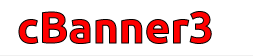
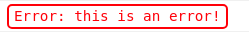

# ConsoleStyles

Js functions to make console logging more beautiful.
There are currently 4 banners , 4 special message,3 text styles.
Every function name starts with c, short form of console.
Therefore, to print out error message, now we dont need console.error(),
instead use cError().

# Setup

Import the script to your website.

# Usage

## banners

### ```cBanner1("cBanner1")```<br>
<br>
### ```cBanner2("cBanner2")```<br>
<br>
### ```cBanner3("cBanner3")```<br>
<br>
### ```cBanner4("cBanner4")```<br>
<br>
## special messages
### ```cError("this is an error!")```<br>
<br>
### ```cWarn("this is a warning")```<br>
<br>
### ```cSuccess("this is Success Message")```<br>
<br>
### ```cRemarks("this is Remarks")```<br>
<br>
## text styles
### ```cBlackGreen("This is cBlackGreen() text style.")```<br>
<br>
### ```cClassicGray("This is cClassicGray() text style.")```<br>
<br>
### ```cClassicBlack("This is cClassicBlack() text style.")```<br>
<br>

# Contribution
If you like to contribute by adding amazing styling functions, feel free to do the same 😉
[x] Make sure to use function name in format => cFunctionName().
[x] Use relevant name.
[x] store style in a variable inside function to make it look clean.
[x] take a screenshot of your output (crop it to fit the size of only the output text, not entire screen).
[x] Update ReadMe file with your function and its output, also add your name to contributers list.

# Contributers
